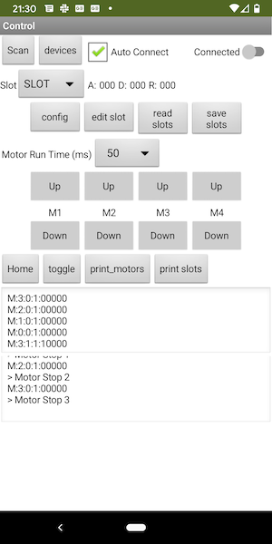

> :warning: **Work in Progress**: Be very careful here!
# mit_app_inventor
## BLE_TEST
 Test app to control the RomeoBLE. Manually set configuration data and control motors

### Bluetooth
* **Scan** - Scans for RomeoBLE boards
* **Devices** - Select which device to connect to
* **Auto Connect** - If selected app the first board found will be connected to
* **Connected** - Enabled when connected to a board.  Tap to disconnect

### Configuration
* Nothing here really works other then reading slot configurations

### Motors
* **Motor Run Time (ms)** - Number of milliseconds to run the motor when an operation below is selected
* **Motor Controls, UP/DOWN** - Move motor up or down a predetermined amount. These buttons will turn green when a motor is running.

### Operations
* **Home** - Home all motors
* **toggle** - 
* **print_motors** - read and print motor status
* **print_slots** - read and print slot configurations